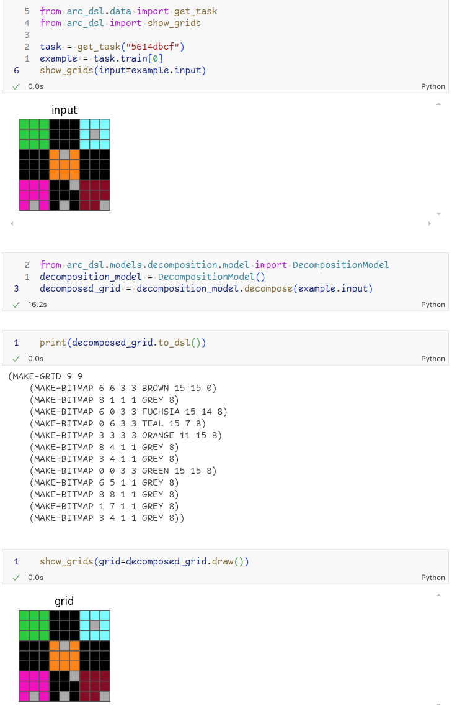

# ARC-DSL

This repository captures work done at Abzu AI for solving the [ARC challenge](https://arcprize.org/). It is incomplete and does not work.

In short, our approach was to define a low-level lisp-like language (gridlisp) in which any grid could be expressed, train transformers to output task-specific DSL in gridlisp, then run search in that DSL to find solutions.

### Gridlisp

A full lisp interpreter in Python, including lambda definitions, with builtin functions for grid-specific operations. See examples in `test/gridlisp_examples.py`.

### Decomposition model (encoder-decoder transformer)

Takes a raw ARC grid as the encoder input and outputs the declarative definition of that grid as a series of bitmap definitions.

Further details about the models can be found in the [models README](arc_dsl/models/README.md).

### Search

Based on type signatures discovered from the gridlisp environment, enumerate possible forms that can return a list of bitmaps for the predicted grid. Development stopped before exploring larger search spaces, so there has yet been no need to implement techniques from genetic programming or elsewhere in order to efficiently find well-scoring forms in the neighbourhood of a candidate.

## Invitation to ARC Prize teams and AI Researchers

Despite being incomplete, this repository contains several components that we believe could be valuable to others:

- **Gridlisp**

  There are many benefits to lisp as the foundation. Programs in Lisp languages are very convenient to parse, modify and evaluate. This simplifies many things: language-specific tokenization for transformers (~100 tokens in the vocabulary), approaches to explore program space and extending funcitonality without risk of running into major refactors.

- **Grid-Specific Transformer Models**

  Encoder-decoder transformers where the encoder accepts raw grids. The vocabulary only has 11 tokens (colors + padding).

- **Infinite Data Generators**

  Our own language and interpreter make it easier to implement infinite training data generators for our transformer models. The ones implemented center around writing down decompositions for non-overlapping objects in terms of bitmaps, but there are obvious next steps (ones we would have taken if time had not run out!). For example, It is easy to imagine task-relevant decompositions (maybe the red squares in the input don't matter, so don't define them) and a model that defines task-relevant functions and objects. Training data for this would be generated by writing down a list of transformations in gridlisp relevant to the core knowledge priors, composing them to discover a huge variety of mock tasks, then applying them to a random input grid. There are a lot of edge cases before quality synthetic data comes out, but we think this route has potential.

Nothing in our approach actually explicitly highlights where any real intelligence or reasoning would take place, we just try to define parts that seem relevant to the overall concept and hope that interesting things appear in their interactions.

We encourage researchers and developers to explore, modify, and build upon our work. Whether you're interested in program synthesis, transformer models, or novel approaches to solving the ARC challenge, we hope this repository serves as a useful resource.

Feel free to **fork** the repository, **experiment** with the code, and **contribute** your findings back to the community. Your insights could help advance the understanding and capabilities in this area of artificial intelligence.

## License

This project is licensed under the terms of the [MIT License](./LICENSE).
